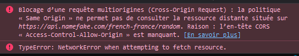

# **no-cors-bridge**
Server to pass through no cors with Axios server side (XMLHttpRequest)

# **Already online**

## **How to use it**

Make a request on : http://vps.tonychouteau.fr/bridge/<request>

Exemple : http://vps.tonychouteau.fr/bridge/https://jsonplaceholder.typicode.com/todos/1

## Pass through cors

```javascript
fetch("https://api.namefake.com/french-france/random")
.then(res => res.json())
.then(data => {
	console.log(data);
});
```


